# ✨ Eslint Configuration
Eslint is a great tool to help us as developers follow a style guide and ensure a consistent code base. Our linter will run on our files and output if we are ever not following these guidelines. 

## Eslint Dependencies 
Our core dependency will be the [eslint package](https://www.npmjs.com/package/eslint). Now there are several optional packages you can install as dependencies depending on how you want to setup the linter. We will be leveraging the built in initilizer for this.

```bash
yarn add eslint --dev
```

## Eslint Initilizer
Once this has been installed we can through the setup process using the built in initilizer. 

```bash 
yarn create @eslint/config
```

This will start an interactive prompt just like `npm init` or `yarn init`.

### Step One 
In this first step we are choosing how we want to use eslint. This is up to your personal use case. For this example we will choose the most demanding use case.

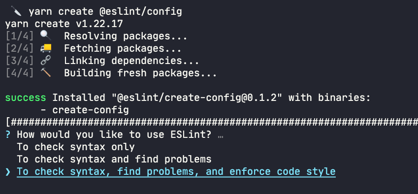

### Step Two 
This step sets how out import statements are configured. In react we are leveraging Javascript Modules so we will select this option.

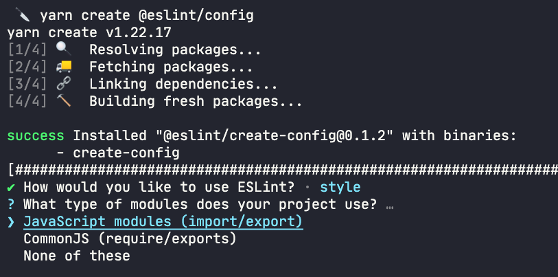

### Step Three
This step is the framework selection. Since we are working in react we choose react here. This will let us install the correct dependencies through this tool.

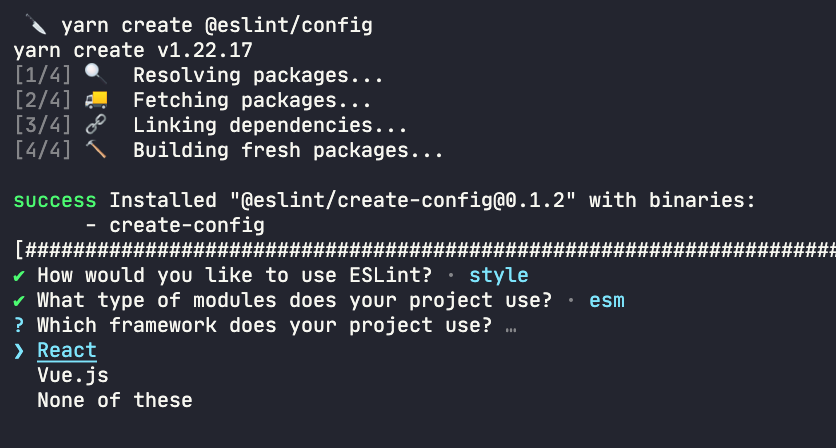

### Step Four 
This step tells the linter if we are using typescript. For this example we are not so we will choose no. 

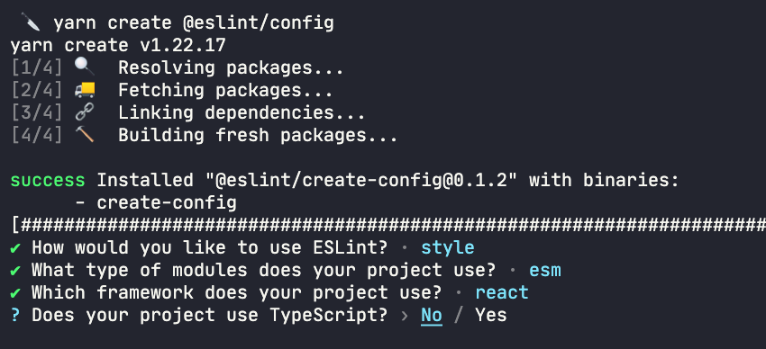

### Step Five 
This step we are selection the enviroment our app will run. Since this is react a client side application we will choose browser. 

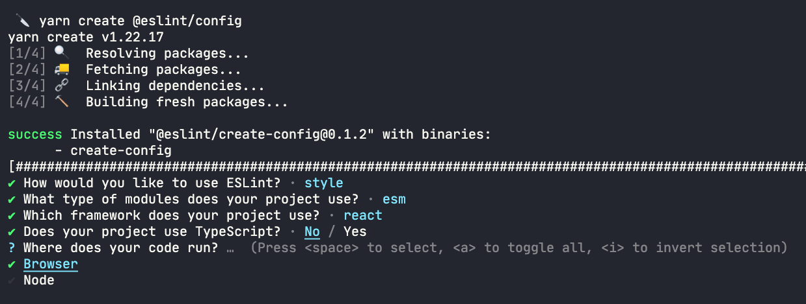

### Step Six 
If you want to follow a predefined style guide you can choose the use existing option OR you can go through a series of questions to define your own. For this example we will use a preexisting style guide. 

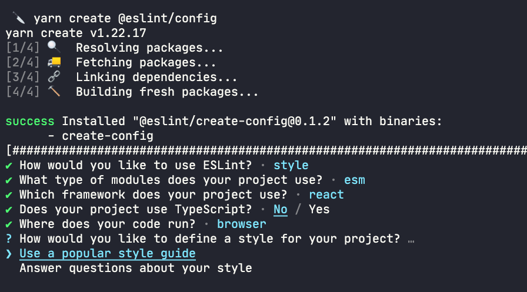

### Step Seven
In this step we can select an existing style guide based on out previous selection. Here we will use the [airbnb style guide](https://github.com/airbnb/javascript) for this example. 

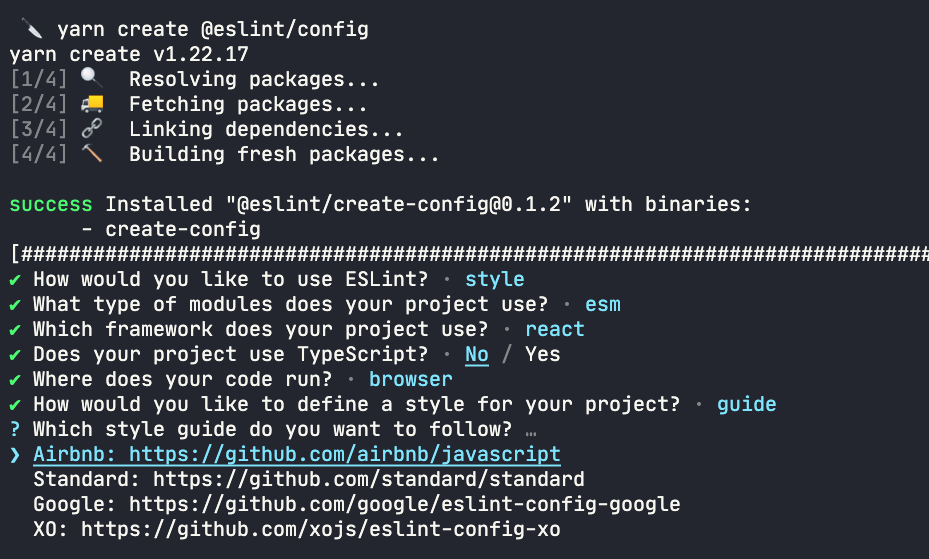

### Step Eight 
This step allows us to choose how we want our configuration file to be created. For this example we use the js version.

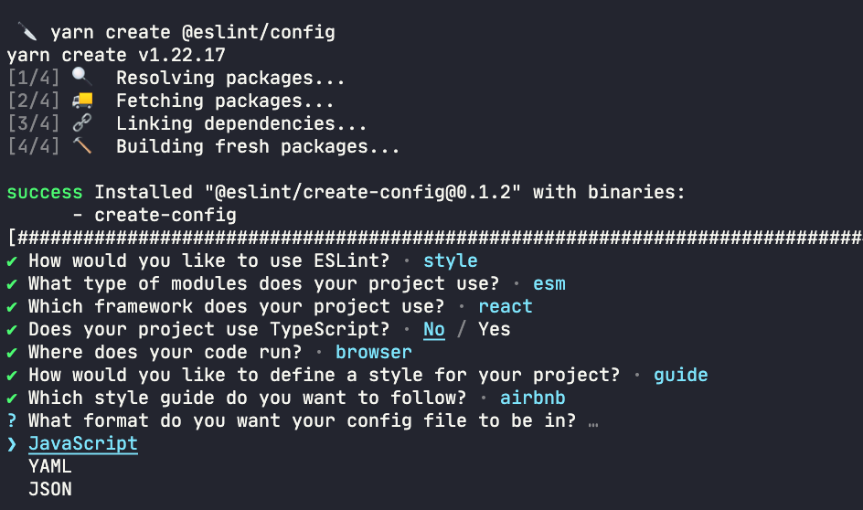

### Step Nine
This step allows choose if we want to install the additional dependencies to support the configurations we choose in the above steps. Here we will select yes. 

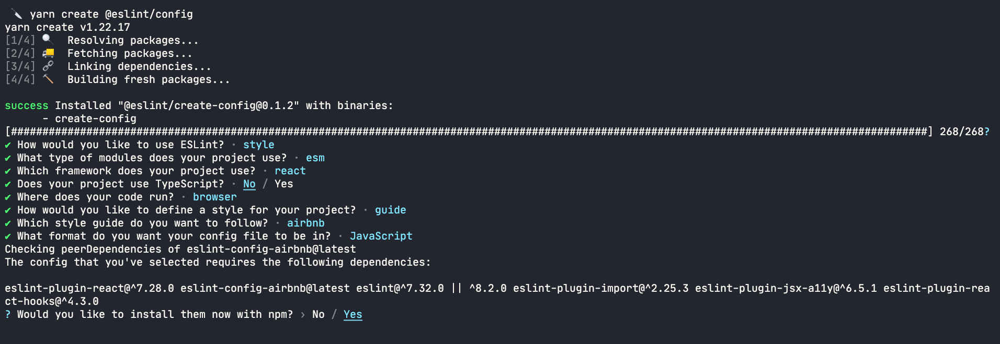

### Step Ten 
Here we are finally done! Our linter has been setup and is ready to use. 

>NOTE: eslint config only leverages npm to install the dependencies so some clean up is manual for yarn users. 
Delete the `package-lock.json` and run `yarn upgrade` to update the yarn lock file.

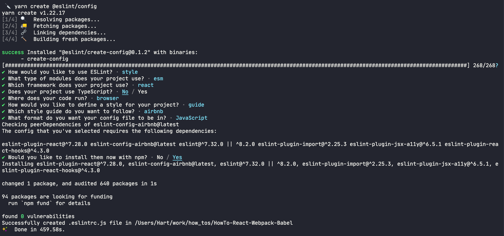


### Current Directory
```
App Directory
├── package.json
├── public
│  ├── bundle.js
│  └── index.html
├── src
│  └── index.jsx
├── .babelrc
├── .eslintrc.js <= new config file
├── webpack.config.js
└── yarn.lock
```

### Preview of linter in VsCode 
Our linter is now hard at work makign sure we are following the rules we set. 

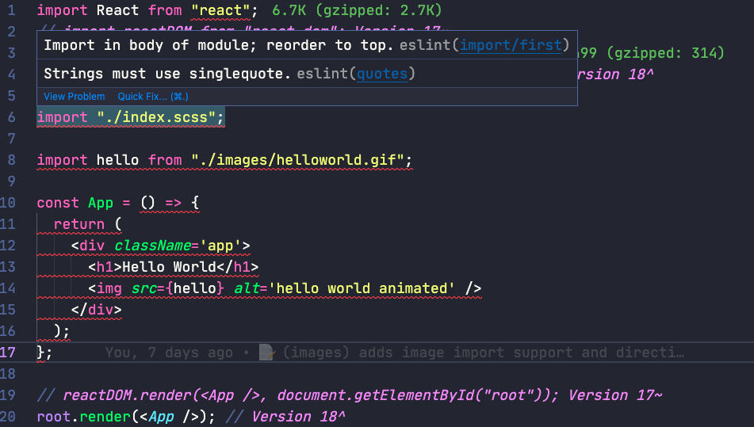

## Enforce Eslint Rules 
Want to enforce these rules with webpack? We can do this with a little bit more setup. 

### Additional Dependencies 

- [eslint-webpack-plugin](https://www.npmjs.com/package/eslint-webpack-plugin) to connect webpack and eslint together. 
- [@babel/eslint-parser](https://www.npmjs.com/package/@babel/eslint-parser) to add the ability to look at our existing eslint config.

```bash 
yarn add eslint-webpack-plugin @babel/eslint-parser --dev
```

### Add to webpack the new plugin.

In webpack.config.js: 
```js 
// at the top add this new import 
const ESLintPlugin = require('eslint-webpack-plugin');
// inside the exports add a new field labels plugins 
module.exports = {
  // ... 
  plugins: [new ESLintPlugin()],
}
```

### Set eslint parser 

In .eslintrc.js: 
```js 
module.exports = {
  env: {
    browser: true,
    es2021: true,
  },
  extends: [
    'plugin:react/recommended',
    'airbnb',
  ],
  // Here is our new parser option set to babel
  parser: "@babel/eslint-parser",
  parserOptions: {
    ecmaFeatures: {
      jsx: true,
    },
    ecmaVersion: 'latest',
    sourceType: 'module',
  },
  plugins: [
    'react',
  ],
  rules: {
  },
};
```

And just like that now when you start up your server you will be forced to follow the rules you set in your configuration! 

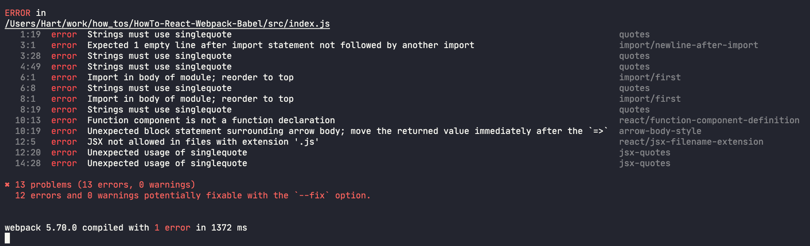